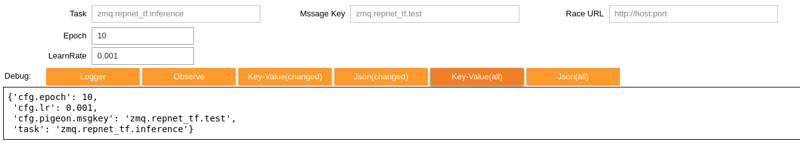
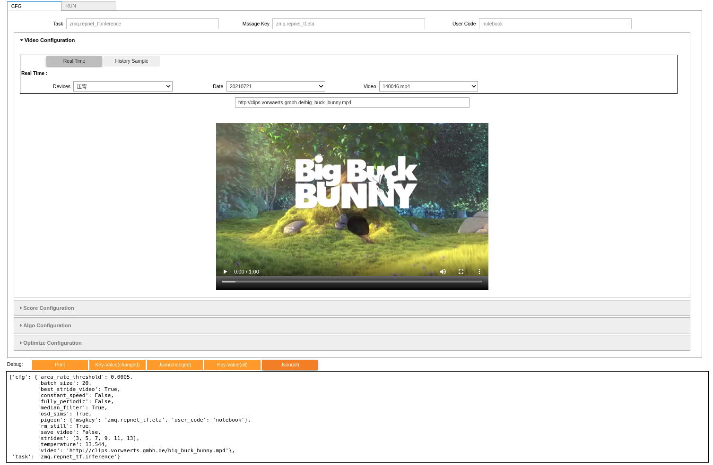

# nb_easy

Jupyter工具库

## easy_widget

通过json配置的schema, 轻松实现可视化参数配置, 可以触发事件交互, 可生成key-value格式,或者json格式.

### 简单实例

```python

# _IMPORT_('import github.com/qrsforever/nb_easy/easy_widget')
_IMPORT_('import gitee.com/qrsforever/nb_easy/easy_widget')

schema = {
    'type': 'page',
    'objs': [
        {
            'type': 'H',
            'objs': [
                nbeasy_widget_string('task', 'Task', 'zmq.repnet_tf.inference', width='30%', readonly=True),
                nbeasy_widget_string('cfg.pigeon.msgkey', 'Mssage Key', 'zmq.repnet_tf.test', width='30%', readonly=True),
                nbeasy_widget_string('__cfg.race_url', 'Race URL', 'http://host:port', width='30%', readonly=True),
            ]
        },
        nbeasy_widget_int('cfg.epoch', 'Epoch', 10, min_=10),
        nbeasy_widget_float('cfg.lr', 'LearnRate', 0.001)
    ]
}
easy = nbeasy_schema_parse(schema, events=None, debug=True)
```

key-value输出(`print(json.dumps(easy.get_all_kv(), indent=4))`:

```json
{
    "task": "zmq.repnet_tf.inference",
    "cfg.pigeon.msgkey": "zmq.repnet_tf.test",
    "cfg.epoch": 10,
    "cfg.lr": 0.001
}
```

json-conf输出(`print(json.dumps(easy.get_all_json(), indent=4))`:

```json
{
    "task": "zmq.repnet_tf.inference",
    "cfg": {
        "pigeon": {
            "msgkey": "zmq.repnet_tf.test"
        },
        "epoch": 10,
        "lr": 0.001
    }
}
```




### 复杂案例(事件联动)

[案例](http://shiori.erlangai.cn/bookmark/1628223720/archive/)


